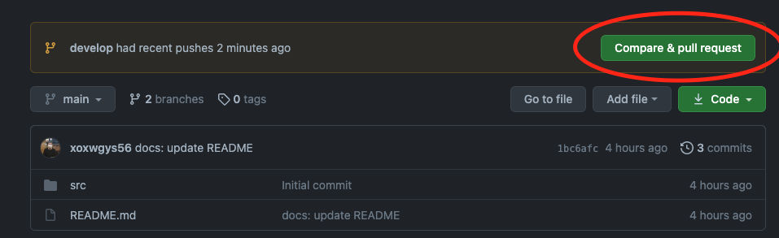
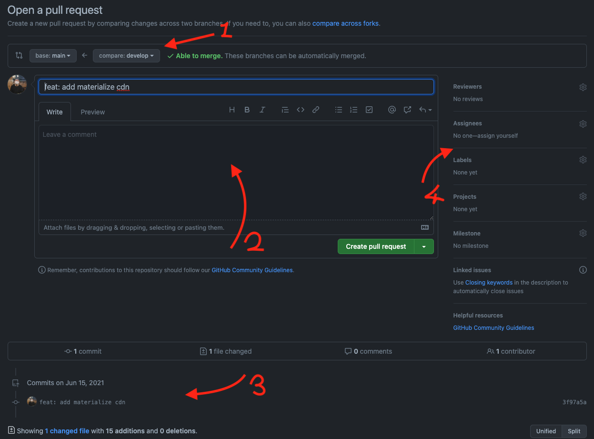
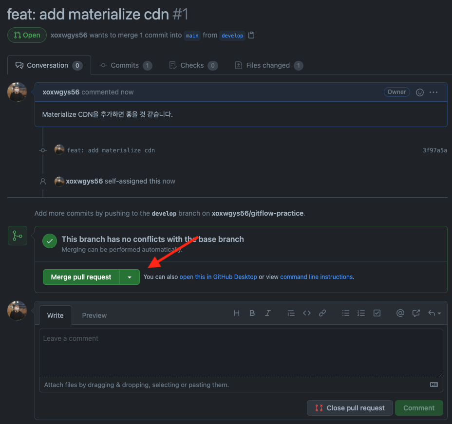
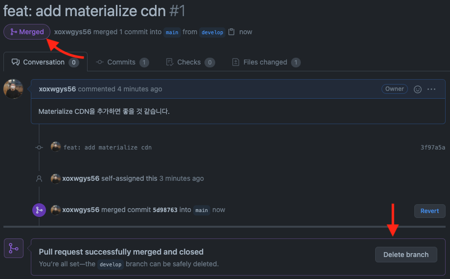
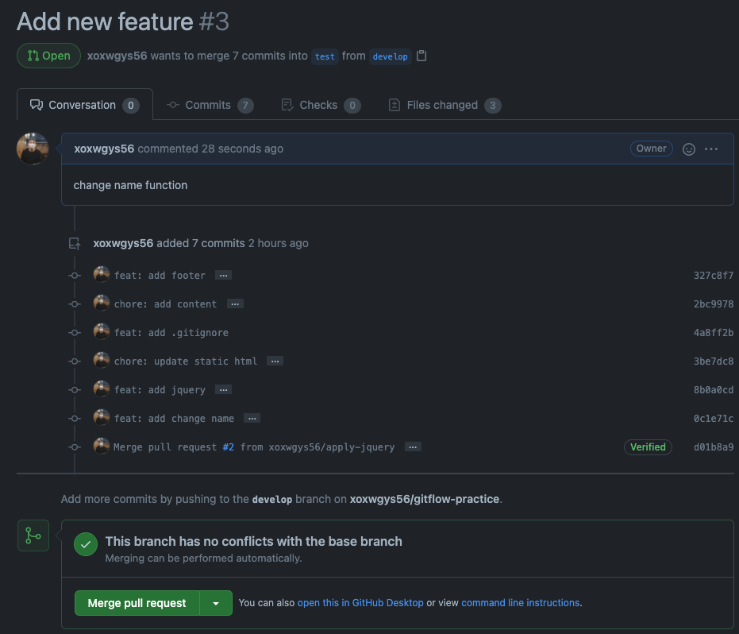

# Git flow

2021-06-16, [Dan](https://github.com/xoxwgys56)

> git flow가 무엇인지에 대해 다룹니다.

## Summary

### 다루지 않는 내용

- what is git
- git add, commit, merge, rebase
- html

### 다루는 내용

- git branch
- pull request (also called, merge request in gitlab)
- git flow (main topic !)

## git flow 무엇인가?

git flow에 대해 다루기 앞서서 github flow를 살펴보겠습니다.  
github flow가 좀 더 단순한 형태이기 때문입니다.  
또한 우리는 여기서 git의 몇가지 명령에 대해서도 다룰 것 입니다.

> 이 챕터의 대부분의 내용은 아래의 url에 기반해 있습니다.
>
> https://guides.github.com/introduction/flow/

간단한 실습을 통해 어떻게 github flow가 동작하는지 알아보겠습니다.  
빈 저장소를 생성해 clone 하겠습니다. 처음 생성된 저장소엔 `main` 브랜치만 존재할 것 입니다.

> 이 문서는 github을 기준으로 합니다. gitlab의 경우 `master` 브랜치가 생성됩니다.  
> 왜 이름이 다른지에 관하여 [Git의 기본 브랜치를 master에서 main으로 변경하기](https://blog.outsider.ne.kr/1503) 글을 참고하면 도움이 될 것 입니다.

아래의 내용들은 제가 출력 내용을 보여드리기 위해 생성한 [저장소](https://github.com/xoxwgys56/gitflow-practice)의 실행 결과입니다.  
예제 프로젝트는 html로 구현한 프로젝트에 대해 다룹니다.  

### start from main branch

생성된 저장소에는 `main` 브랜치만 존재합니다. 일반적으로 `main` 브랜치는 언제나 배포하여 상용 가능한 버전이어야 합니다.  
이 예시에서는 chillin-out-seongsu를 소개하는 웹페이지를 만드려고 합니다.  

```shell
$ git branch

* main
(END)
```

미리 `main` 브랜치에 빈 html을 생성했습니다. `develop` 브랜치를 생성하고 해당 브랜치로 이동하겠습니다.

```shell
$ git checkout -b develop
```

브랜치를 이동해도 바뀌는 것은 없습니다. 같은 내용의 코드가 `main`(상용화 가능 버전) `develop`(개발 버전)으로 나뉘어져있을 뿐입니다.

### start develop with develop branch

`develop` 브랜치에 새로운 개발 사항을 적용해보겠습니다.

> 빈 html은 이쁘지 않으니, [materialize cdn](https://materializecss.com/getting-started.html)을 추가하고 또한 시각적으로 확인하기 위해 nav tag도 추가하겠습니다.  

개발이 적용된 사항을 커밋하고, `develop` 브랜치에 푸시합니다.

> 이 곳에서 다루는 `develop` 브랜치는 새로운 코드를 적용하기 위한 개발 브랜치라는 의미로 사용되었습니다.

```shell
$ git add src
$ git commit
$ git push

fatal: 현재 브랜치 develop에 업스트림 브랜치가 없습니다.
현재 브랜치를 푸시하고 해당 리모트를 업스트림으로 지정하려면
다음과 같이 하십시오.

    git push --set-upstream origin develop

$ git push --set-upstream origin develop

# finished push develop branch with new commit !
```

### PR merge

이제 저장소 페이지로 가봅시다.



이제 우리는 PR (Pull Request)를 만들 수 있습니다. 버튼을 눌러 PR을 생성합니다.  

> Pull Request는 무엇일까요? git merge 명령과 비슷하다고 생각하시면 됩니다.  
> git merge 명령과의 차이는 Pull Request는 로컬 환경에서 Merge하는 것이 아닙니다. 로컬 환경에서 Merge를 진행하게 된다면 누가 Merge를 했고, 코드는 검사되었는지 확인할 수 없을 것 입니다. (아마도?)  
> 하지만 Pull Request를 통해 Merge한다면, 코드를 리뷰받고 Merge된 기록을 commit이 아닌 형태로 남길 수 있습니다.



사진에서 pull request의 몇가지 포인트를 화살표로 지정했습니다. 번호 순서대로 설명드리겠습니다. (번호.. 알아보시겠죠..?)

1. 우리는 `develop` 브랜치에서 `main` 브랜치로 Merge하고자 합니다. 비교 대상이 되는 compare=`develop`, Merge 결과가 남는 base는 `main` 브랜치입니다.
2. 제목과 내용이 있는데, 여기에 생성되는 기본 정보는 커밋 메세지에서 가져오는 정보를 기반으로 합니다. 제목으로 작성된 `feat: add materialze cdn`은 제가 작성한 커밋 메세지입니다.
3. 어떤 커밋들을 Pull Request에 포함시켰는지 다룹니다. 이 PR은 하나의 커밋만 포함되어 있네요.
4. 이 중 _Reviewers_에 대해서만 다루겠습니다. 지정된 reviewer에게 리뷰를 받기 위함입니다.

`PR`을 생성하면 아래와 같은 화면이 보입니다.



> 이 저장소에는 저 혼자라 리뷰할 사람이 없군요.. 😿 리뷰 과정은 생략하겠습니다.

이제 `Merge pull request` 버튼을 눌러서 Merge합니다.



Merge를 하고 나면 생성한 `PR`은 `Merged`로 표기됩니다. 또한 Merge된 브랜치를 삭제할 것인지 물어봅니다. 이 예시에서는 삭제하지 않을 것 입니다.  

> 다시 2개의 브랜치가 같은 내용을 공유하게 되었습니다. 이 과정에서는 unittest가 생략되었기 때문에 브랜치 병합(Merge)가 너무 쉽게 이뤄졌습니다. 이렇게 개발한다면 굳이 브랜치를 나눠 쓸 필요 없습니다.

여기까지 다룬 내용이 github flow에 관한 내용이었습니다. 소규모팀의 개발이라면 이 정도의 내용으로도 충분합니다.  
이 다음 내용에서 git flow와 브랜치 이름을 `develop`으로 설정한 이유에 대해 알아보겠습니다.


## 그래서 git flow란 무엇인가?

[A successful Git branching model](https://nvie.com/posts/a-successful-git-branching-model/)이라는 [Vincent Driessen](https://nvie.com/about/)이 작성한 블로그에서 처음 소개된 개념이라고 알려져 있습니다.  
아래의 사진이 git flow를 나타낸 그림으로 유명합니다.
앞서 github flow를 먼저 다룬 이유는 `Vincent Driessen`가 소규모팀에 대해 github flow를 권장하기 때문입니다.


> 그는 이렇게 말하고 있습니다.

```
I would suggest to adopt a much simpler workflow (like GitHub flow) instead of trying to shoehorn git-flow into your team.
```

위의 예시에서 우리는 `develop` 브랜치를 생성하여 기능을 구현하고 `PR`을 생성해 Merge하였습니다. 이러한 과정을 거친 이유는 아래와 같습니다.  

### 우리는 혼자서 개발하지 않기 때문입니다. 다른 사람과 함께 개발할 것 입니다.

다른 사람과 개발한다는 말은 여러 의미를 담고 있습니다. `name convention`, `programming lagnuage`, `dependencies` etc..  
예시 저장소에서 `develop` 브랜치는 혼자 사용했습니다. 하지만 개발을 하다보면 여러 사람이 함께 개발과정에 참여하게 되고 `develop` 브랜치 또한 공유하게 됩니다.  


개발자들은 각각의 로컬 기기에서 개발을 하게 될 것 입니다. (Mac이든 Windows든 Ubuntu든 뭐든지요!) 로컬 환경에서 개발된 코드는 각자의 검증과정(unittest든 가상환경 테스트든 뭐든지! 안하는건 조금 별로다!)을 통해 각 브랜치 내에서 커밋을 생성하고 push할 것 입니다.  

> 각각의 브랜치 이름은 사람 이름보단 기능명 혹은 담당하고 있는 내용으로 표현하는 것이 좋을 것 같습니다. 이 글에서는 이것을 `feature` 브랜치라고 부르겠습니다.

이렇게 개발된 코드들이 `develop` 브랜치에 병합(Merge)되어야 하는 순간이 발생합니다.  

> 기능이 다 구현되어 병합하는 경우도 있고, `develop` 브랜치에서 테스트해야하기 때문에 병합할 수도 있습니다. 이유는 각자 다른 것 입니다.

그리고 병합된 커밋들은 `develop` 브랜치에 누적되게 됩니다. 이렇게 점진적으로 개발하다보면 어느새 향상된 개발 버전의 프로그램이 구현되겠군요. (그러면 좋겠다.)  

### 브랜치를 더 분할하자.

이 프로젝트에서 우리는 `jquery`를 적용하여 이름을 변경하는 기능을 개발하려고 합니다. 이 기능을 `apply-jquery`라는 브랜치에서 구현한 뒤 `develop`로 `PR`을 만들어서 적용할 것 입니다. 하지만 이 기능을 적용 후 사용자에 의해테스트하지 않아서 상용으로 넘기긴 불안합니다.  

우리는 `QA`(Quality Assuarance)가 필요해졌습니다. 이제 사업팀에서 개발된 기능을 테스트하여 자체적으로 문제가 없다고 판단되면 이것을 상용화에 적용하기로 했습니다.  

> 앞에서 우리는 `develop` 브랜치에서 구현된 기능을 바로 `main` 브랜치로 병합했습니다. 하지만 이것은 개발 내 테스트만 완료되었기 때문에 불안정할 수 있습니다. (유저가 우리 프로그램으로 뭘 할지 모르잖아요...) 우리는 사용자를 대신하여 사업팀에서 테스트를 할 수 있도록 설계해야 합니다.  

사업팀에서 `QA`를 하기 위한 브랜치를 우리는 `test` 브랜치라고 부르기로 했습니다. (누군가는 `staging`라고 부를 수도 있습니다.) 우리는 `develop` 브랜치에서 개발자들에 의해 테스트가 완료된 코드를 `test` 브랜치에 올려 `QA`가 가능하도록 구성하도록 했습니다.  

### QA 요청하자.

> 이 예시에서는 사업팀에서 `QA`를 진행하는 것으로 가정되어 있습니다. 어디서 할지 등에 대한 세부 사항은 팀에 따라 다를 수 있습니다.

현재 우리에겐 `test` 브랜치가 없습니다. `main` 브랜치를 base로 `test` 브랜치를 생성하겠습니다. (가장 안정된 코드를 사용해야하니까요) 그리고 다음에 `develop` 브랜치를 `test`로 병합하겠습니다. (사업팀이 이를 확인해줄거에요.)  
병합하기 위해 `develop` 브랜치에서 `test` 브랜치로  `PR`을 만들어줄 것 입니다.



이제 `PR`을 병합하면 `test` 브랜치를 통해 사업팀이 기능을 확인할 수 있을 것 입니다. 좋습니다. 잘진행되고 있군요.

### 이렇게 개발을 하다니

사업팀에서 답변이 왔습니다. `jquery`를 적용해 이름을 바꾸는 기능에 문제가 발견되었다고 합니다. 이름을 빈 칸으로 두면 아예 이름이 사라지는 것이 문제라고 합니다.  

이것은 치명적인 문제가 아니고 이름을 비우는 것은 당연히 이름이 없는게 맞다고 생각했는데.. 사업팀은 동의하지 못하는 것 같습니다. 우리는 이 문제를 수정해 재반영하기로 했습니다.  

> 여기서 `test` 브랜치의 `HEAD`를 이전으로 바꾸는 것은 다루지 않습니다.  
> 또한 이 문제를 `issue`로 만드는 것도 다루지 않습니다.

우리는 `develop` 브랜치에서 `fix-apply-jquery`라는 브랜치를 만들었습니다. (위에서 언급했듯이 이 시점에서 `apply-jquery`는 이미 합병되었습니다.)  
기능을 수정하고, `develop`브랜치로 `PR`을 만들었습니다.  

> input이 비어있을 경우 이름을 _John Doe_로 설정하도록 구현했습니다.

이제 다시 `test` 브랜치로 이동합니다. 휴! 이제 사업팀이 만족하는군요.


### 그렇구나

이 과정을 통해 개발 코드가 어떻게 상용화 버전까지 이동하는지 알 수 있습니다.  

1. 로컬 환경에서 개발한 다음 각자의 브랜치에 커밋을 생성합니다.
   1. `feature/apply-materialize-cdn`이라고 하겠습니다.
2. 구현이 완료된 코드를 `develop` 브랜치로 `PR`을 생성합니다.
   1. reviewer를 설정한다면 더 좋겠네요. (추가 할 사람이 있어야 하는데...)
3. `develop` 브랜치에 도착한 코드는 `develop` 환경에서 테스트됩니다. 만약 문제가 없다면, `test` 브랜치로 `PR`을 생성합니다.
4. `test` 브랜치로 옮겨진 코드는 사업팀에 의해 `QA`를 하게 됩니다.
5. 문제가 없는 코드라면 상용화 버전으로 옮겨도 되겠네요. 언제 상용화 버전으로 옮길지는 사업팀에서 결정할 것 입니다. 이 예시의 경우 `main` 브랜치로 이동될 것 입니다.


## 회사에서 어떻게 쓰고 있는가?

현재 회사에서는 아래의 3개의 브랜치를 사용하고 있습니다.
`develop`, `test`, `release-*`

> `release-*`은 `release-0.0.1`, `release-1.3.19`등의 release version number를 의미합니다.

위에서 언급한 것처럼 `test`에서 `QA`가 이뤄지면 좋겠지만.. 현재는 진행하지 않고 있습니다.  

### 웹 기반

우리 서비스는 웹 기반으로 동작하는 서비스입니다. front-back-client가 엮여있는 관계인데, front에서 명령을 하면, back을 통해 client가 동작하는 형태입니다.  

이 동작을 테스트하기 위해 2개의 도메인이 존재합니다. `develop`, `beta`(=`release`)의 도메인이 있으며, `develop`는 테스트용으로 사용하기 때문에 프로젝트 생성 수 제한이 다르게 설정되어 있습니다.

---

## References

- [published issue](https://github.com/xoxwgys56/chillin-out-in-seongsu/issues/3)
- git flow
  - https://nvie.com/posts/a-successful-git-branching-model/ who mentioned
  - https://woowabros.github.io/experience/2017/10/30/baemin-mobile-git-branch-strategy.html
  - https://danielkummer.github.io/git-flow-cheatsheet/index.ko_KR.html
  - https://jeong-pro.tistory.com/196
  - https://guides.github.com/introduction/flow/
  - https://blog.ull.im/engineering/2019/06/25/git-workflow-for-ci-cd.html
- example repo
  - https://github.com/xoxwgys56/gitflow-practice
- git review
  - https://github.com/im-d-team/Dev-Docs/issues/11
  - https://devlog-wjdrbs96.tistory.com/231
- PR
  - https://softwareengineering.stackexchange.com/questions/304921/is-it-better-to-start-a-pull-request-or-perform-a-local-merge-commit-on-master